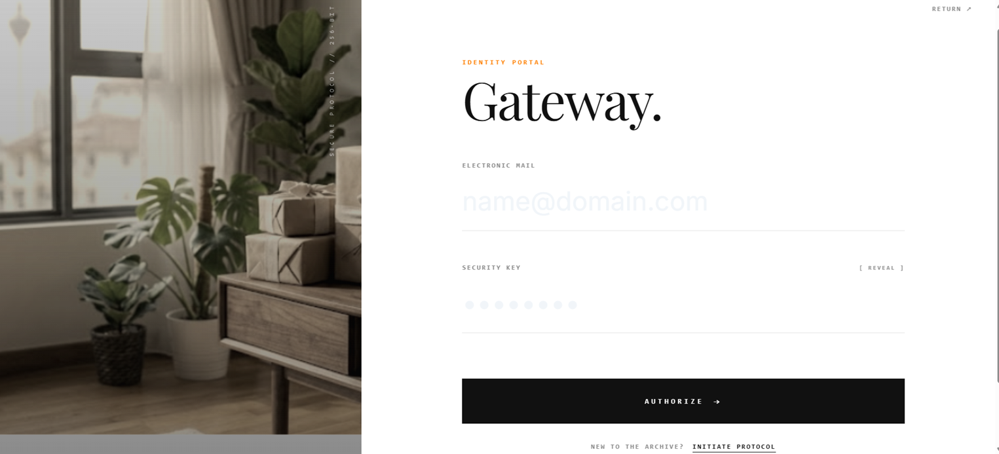
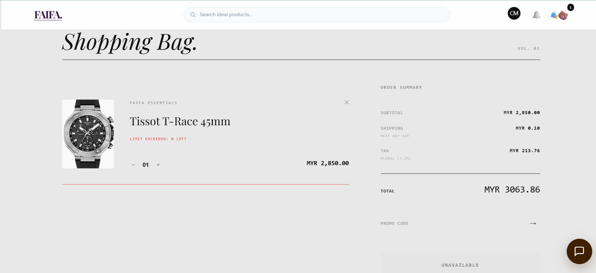
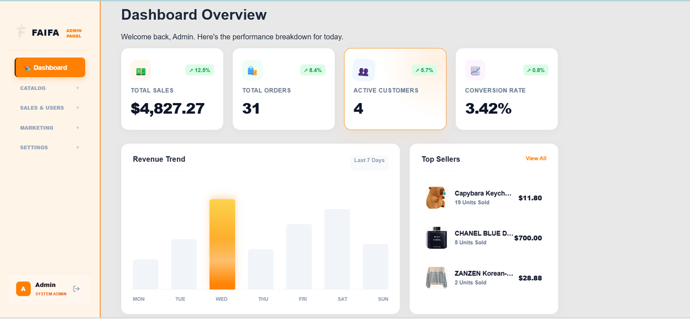
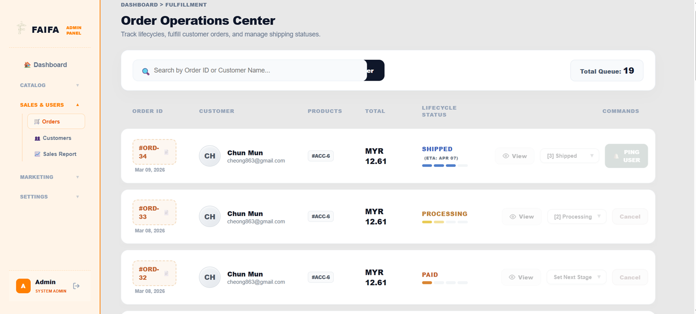

# 🛒 Shopping Website (Final Year Project)

A responsive e-commerce website inspired by Shopee, developed as my Final Year Project. The system provides separate **Client** and **Admin** panels, allowing customers to browse and purchase products while enabling administrators to efficiently manage products, orders, and users.

The project was built to strengthen my understanding of full-stack web development, responsive web design, database integration, and user experience.

---

## 🚀 Technologies

- HTML5
- CSS3
- Bootstrap 5
- PHP
- MySQL
- XAMPP

---

## ✨ Features

### 👤 Client Panel

- User Registration
- User Login
- Product Browsing
- Product Details
- Shopping Cart
- Checkout
- Order History
- Responsive Design

### 🔧 Admin Panel

- Admin Login
- Dashboard
- Product Management (CRUD)
- Category Management
- Order Management
- Customer Management
- Database Integration

---

## 📸 Screenshots

### 🏠 Home Page

> *(Insert screenshot here)*

---

### 🔐 Login Page

> *(Insert screenshot here)*

---

### 🛒 Shopping Cart

> *(Insert screenshot here)*

---

### 📊 Admin Dashboard

> *(Insert screenshot here)*

---

### ⚙️ Product Management

> *(Insert screenshot here)*

---

## 💼 My Responsibilities

As the primary developer of this project, I was responsible for:

- Front-end Development
- Responsive UI Design
- Bootstrap Layout Design
- PHP Development
- MySQL Database Integration
- CRUD Function Development
- User Authentication
- Testing & Debugging
- System Documentation

---

## 📚 Learning Outcomes

Throughout this project, I gained practical experience in:

- Responsive Web Development
- Full-stack Web Development
- PHP & MySQL Integration
- Database Design
- User Authentication
- CRUD Operations
- Problem Solving
- Debugging
- UI/UX Design Principles

---

## 🎯 Future Improvements

- Online Payment Integration
- Wishlist Feature
- Product Search & Filter
- Email Verification
- User Profile Management
- Sales Analytics Dashboard
- Dark Mode Support
- Laravel Framework Migration

---

## 👨‍💻 Author

**Cheong Mun Chun**

Bachelor of Science (Hons) Multimedia Computing  
Liverpool John Moores University (LJMU)

Currently seeking a **Front-end Developer Internship**.

